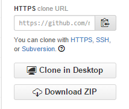

### Requirements
#### **`MATLAB`**

To use `eegDb` you should have `MATLAB` installed (version 2008a or newer should work). You can test your `MATLAB` version by running:
```matlab
f = figure();
set(f, 'WindowKeyPressFcn', @(o, e) disp('It works!'));
close(f);
[~, pos] = min([3 2 5]);
```
If this piece of code runs without problems, you should be ok.

#### **`eeglab`**

You also need to have `eeglab` installed and on your matlab path. You can test whether `eeglab` is available by running:
```matlab
~isempty(which('eeglab'));
```
If this returns true that means at least one `eeglab` is available on your path. It is best to have only one `eeglab` present on your path. You can test that later (once you installed `eegDb`) with `eegDb_setup()`.
If you do not have `eeglab` installed (or on your path) you can follow [these instructions](http://sccn.ucsd.edu/eeglab/downloadtoolbox.html). 

### Installation
***download the ZIP***  
The easiest way to install is to copy the repository to your local drive is to grab the zip file provided on the lower right of the [front page](https://github.com/mmagnuski/eegDb). It looks like this:  
  
Just click the `Download ZIP` button and unpack the zip wherever you want.  

***clone with git***  
If you are comfortable using git you can copy the repository using `git clone`:
```git
git clone https://github.com/mmagnuski/eegDb.git
```
But downloading ZIP is really OK if you are not familiar with git.

***Add path***  
Once you have copied `eegDb` you should make sure that the directory you copied the repository into (let's say it's `D:\TOOLS\eegDb\`) is on your matlab path:
```matlab
addpath('D:\TOOLS\eegDb\');
```
**add info on saving path** Then you can run `eegDb_setup` ans start having fun with `eegDb`!
```matlab
eegDb
```
:exclamation: Please note that you need to run `eegDb` each time you restart matlab and start your work with `eegDb`. **(add some info here on creating project scripts that set up environment for a given project)**
