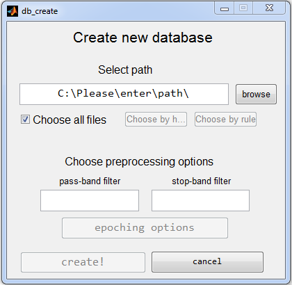

# database
`eegDb` uses matlab structures to represent information about the data and all preprocessing steps. 
This matlab structure is referred to as database, and conventionally stored in `db` variable. 
Before you can start using the main `eegDb` graphical interface (`db_gui`) you need to create a database. 

## creating database with GUI
To create the database using a graphical user interface type this in matlab command window:
```matlab
db_create
```  
You should see the window below:  
 

In the edit box you can specify the path to your data files. You can also use the `browse` button to manually locate the folder.
Currently `eegDb` works only for `.set` files - so if your data is in a different format you would need to convert it to `.set`. These files should be raw - in the sense that no preprocessing like filtering or epoching has been performed on them.
